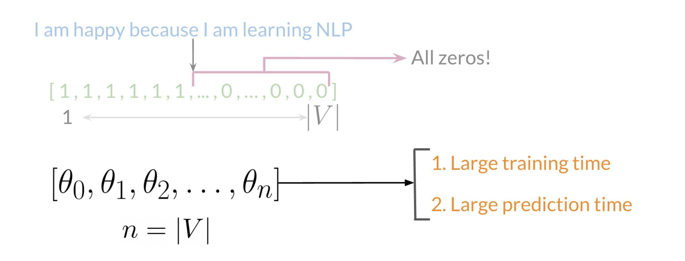
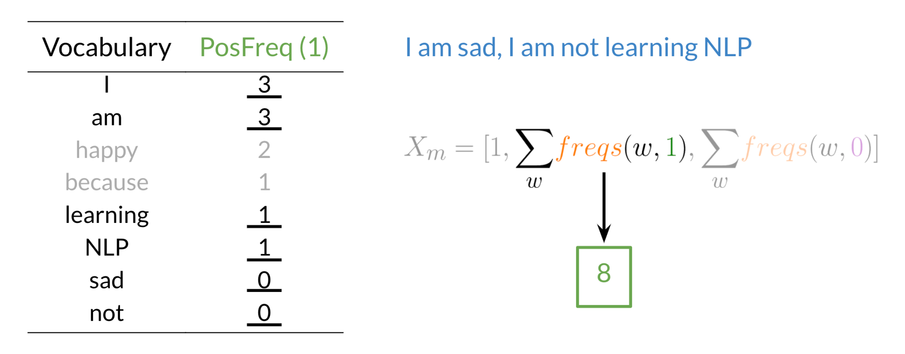

# Important NLP concepts
### resources
[Coursera NLP course] (https://www.coursera.org/learn/classification-vector-spaces-in-nlp)

### Logistics Regression
In this, we will classify tweets in to positive or negative sentiments using Logistic regression. Let us first understand supervised machine learning:
#### Supervised machine learning   
In supervised machine learning, you usually have an input X, which goes in to your prediction function to get you ŷ.  
You can then compare your prediction with the true value YY. This gives you your cost which you use to update the parameters θ (theta).  
The following image, summarizes the process. 

#### Vocabulary and feature extraction
Given a tweet, or some text, you can represent it as a vector of dimension |V|, where |V| corresponds to your vocabulary size.  
If you had the tweet "I am happy because I am learning NLP", then you would put a 1 in the corresponding index for any word  
in the tweet, and a 0 otherwise.  

As you can see, as |V| gets larger, the vector becomes more sparse. Furthermore, we end up having many more features and  
end up training θ |V| parameters. This could result in larger training time, and large prediction time.  
  

Clearly we there should be another way to reduce number of parameters

#### Feature Extraction with frequencies
Given a corpus with positive and negative tweets:  
| Positive Tweets      | Negative Tweets |
| ----------- | ----------- |
| I am happy because i am learning NLP      | I am sad, i am learning NLP       |
| I am happy   | I am sad        |  

you have to encode each tweet as a vector. Previously, this vector was of dimension V. Now you can represent it with a  
dimension of 3.  To do so, you have to create a dictionary to map the word and its class to the number of times it appeared in the class.  
| Vocab      | Positive Freq | Negative Freq |
| ----------- | ----------- | ----------- |
| I | 3 | 3 |
| am | 3 | 3 |
| happy | 2 | 0 |
| because | 1  | 0 |
| learning | 1 | 1 |
| NLP | 1 |  1 |
| sad | 0 |  2 |
| not | 0 | 1 |  
freqs --> dictionary mappring from (word, class) to frequency.  
In the past two videos, we call this dictionary `freqs`. In the table above, you can see how words like happy and sad  
tend to take clear sides, while other words like "I, am" tend to be more neutral. Given this dictionary and the tweet,  
"I am sad, I am not learning NLP", you can create a vector corresponding to the feature as follows.    

To encode the negative frequencies, you can do the same thing.  
  

  

