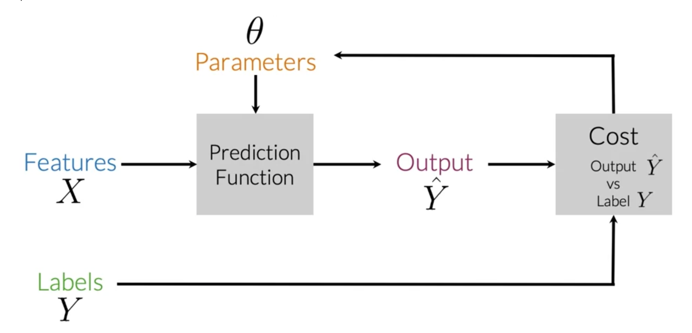

# Important NLP concepts
### resources
[Coursera NLP course] (https://www.coursera.org/learn/classification-vector-spaces-in-nlp)

### Logistics Regression
In supervised machine learning, you usually have an input X, which goes in to your prediction function to get you ŷ.  
You can then compare your prediction with the true value YY. This gives you your cost which you use to update the parameters θ (theta).  
The following image, summarizes the process. 

  

