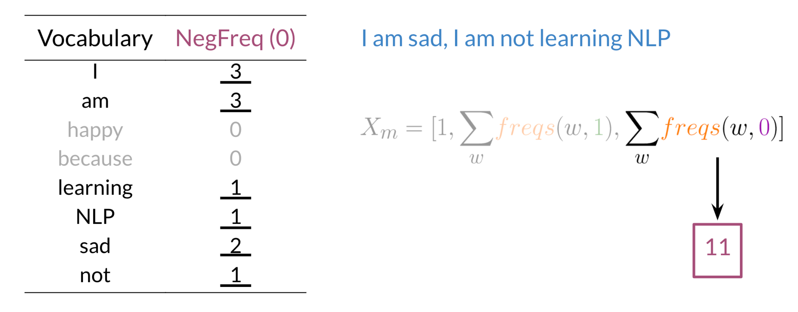
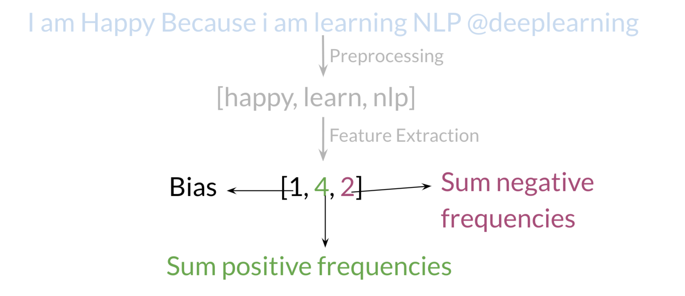
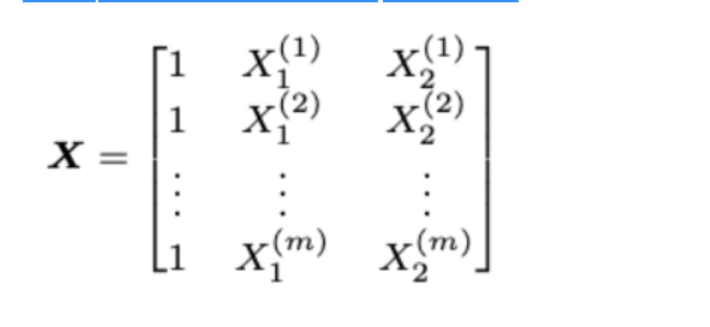
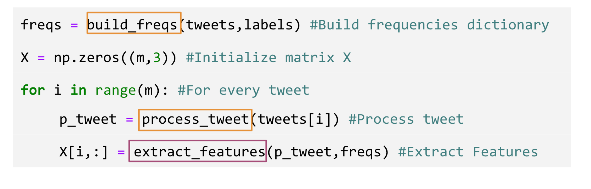
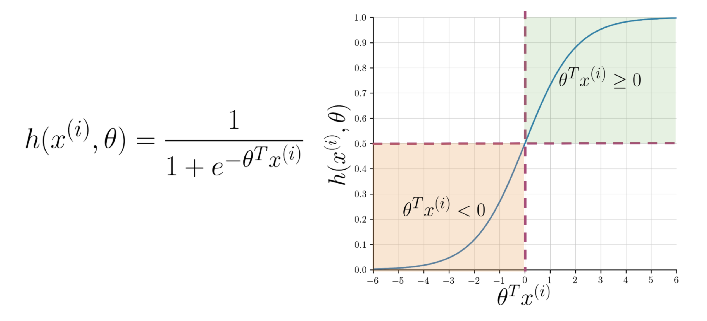
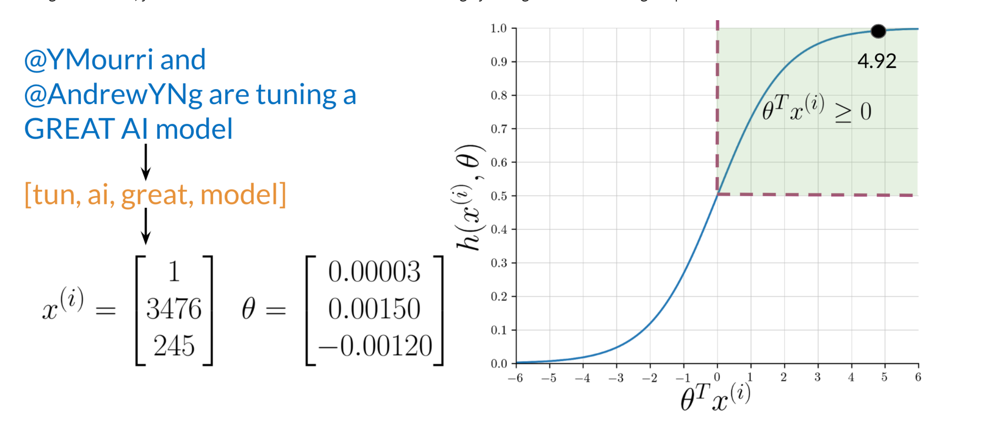
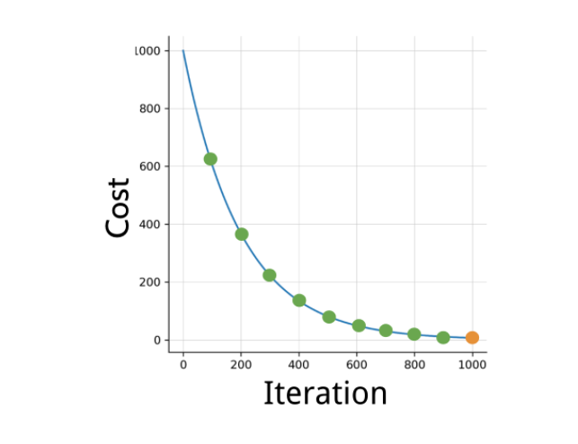
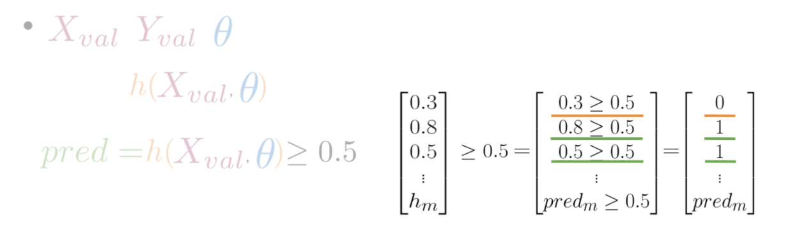
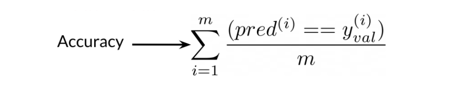

# Important NLP concepts
### resources
[Coursera NLP course] (https://www.coursera.org/learn/classification-vector-spaces-in-nlp)

#### Supervised machine learning   
In supervised machine learning, you usually have an input X, which goes in to your prediction function to get you ŷ.  
You can then compare your prediction with the true value YY. This gives you your cost which you use to update the parameters θ (theta).  
The following image, summarizes the process. 

#### Vocabulary and feature extraction
Given a tweet, or some text, you can represent it as a vector of dimension |V|, where |V| corresponds to your vocabulary size.  
If you had the tweet "I am happy because I am learning NLP", then you would put a 1 in the corresponding index for any word  
in the tweet, and a 0 otherwise.  

As you can see, as |V| gets larger, the vector becomes more sparse. Furthermore, we end up having many more features and  
end up training θ |V| parameters. This could result in larger training time, and large prediction time.  
  

Clearly we there should be another way to reduce number of parameters

#### Feature Extraction with frequencies
Given a corpus with positive and negative tweets:  
| Positive Tweets      | Negative Tweets |
| ----------- | ----------- |
| I am happy because i am learning NLP      | I am sad, i am learning NLP       |
| I am happy   | I am sad        |  

you have to encode each tweet as a vector. Previously, this vector was of dimension V. Now you can represent it with a  
dimension of 3.  To do so, you have to create a dictionary to map the word and its class to the number of times it appeared in the class.  
| Vocab      | Positive Freq | Negative Freq |
| ----------- | ----------- | ----------- |
| I | 3 | 3 |
| am | 3 | 3 |
| happy | 2 | 0 |
| because | 1  | 0 |
| learning | 1 | 1 |
| NLP | 1 |  1 |
| sad | 0 |  2 |
| not | 0 | 1 |  
  
  
freqs:  dictionary mappring from (word, class) to frequency.  
In the past two videos, we call this dictionary `freqs`. In the table above, you can see how words like happy and sad  
tend to take clear sides, while other words like "I, am" tend to be more neutral. Given this dictionary and the tweet,  
"I am sad, I am not learning NLP", you can create a vector corresponding to the feature as follows.    

To encode the negative frequencies, you can do the same thing.  
 
  
Hence you end up getting the following feature vector [1,8,11][1,8,11]. 11 corresponds to the bias, 88 the positive feature,  
and 1111 the negative feature.  
#### Preprocessing
When preprocessing, you have to perform the following:

1. Eliminate handles and URLs

2. Tokenize the string into words. 

3. Remove stop words like "and, is, a, on, etc."

4. Stemming- or convert every word to its stem. Like dancer, dancing, danced, becomes 'danc'. You can use porter stemmer to take care of this. 

5. Convert all your words to lower case.  
For example the following tweet "@YMourri and @AndrewYNg are tuning a GREAT AI model at https://deeplearning.ai!!!" after preprocessing becomes.  
[tun,great,ai,model].  
Hence you can see how we eliminated handles, tokenized it into words, removed stop words, performed stemming, and converted everything to lower case.  
Overall process can be represented as below:  
  
Your X becomes of dimension (m,3) as follows:  

When implementing it with code, it becomes as follows:  
  

### Logistics Regression Overview
In this, we will classify tweets in to positive or negative sentiments using Logistic regression.  
Logistic regression makes use of the sigmoid function which outputs a probability between 0 and 1. The sigmoid function with some weight parameter θ and some input x^(i) 
is defined as follows.  
  
Note that as θ^T x^(i)  gets closer and closer to −∞  the denominator of the sigmoid function gets larger and larger and as a result, the sigmoid gets closer to 0 On the other hand, as \theta^Tx^{(i)}θ 
θ^T x^(i)  gets closer and closer to ∞  the denominator of the sigmoid function gets closer to 1 and as a result the sigmoid also gets closer to 1.   
  
Now given a tweet, you can transform it into a vector and run it through your sigmoid function to get a prediction as follows:  
  

### LR training
~  
You initialize your parameter \thetaθ, that you can use in your sigmoid, you then compute the gradient that you will use  
to update \thetaθ, and then calculate the cost. You keep doing so until good enough.   

Note: If you do not know what a gradient is, don't worry about it. I will show you what  
it is at then end of this week in an optional reading. In a nutshell, the gradient allows you to learn what \thetaθ is  
so that you can predict your tweet sentiment accurately. 
Usually you keep training until the cost converges. If you were to plot the number of iterations versus the cost,  
you should see something like this:  
   

### LR Testing
To test your model, you would run a subset of your data, known as the validation set, on your model to get predictions.  
The predictions are the outputs of the sigmoid function. If the output is \geq =0.5 ≥=0.5, you would assign it to a positive class.  
Otherwise, you would assign it to a negative class.  
  
  

 

  

  

